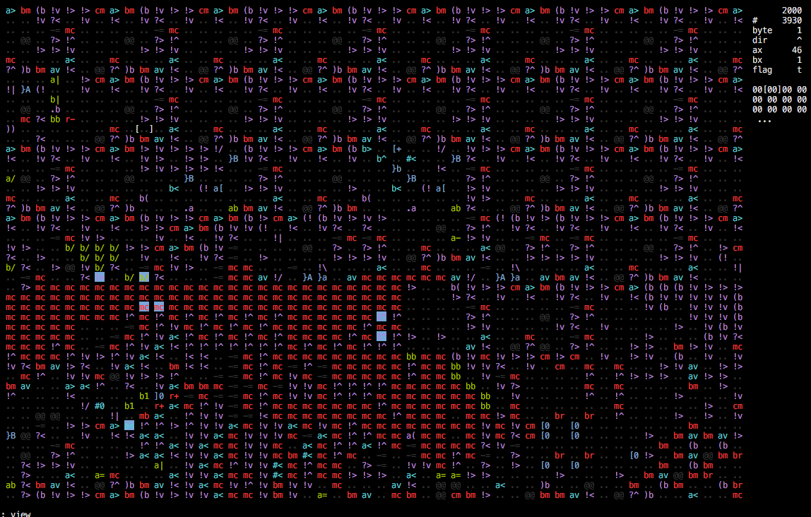

# Myco: An Artificial Life Experiment

Myco is an experiment in artificial life based on [fungeoid](http://esolangs.org/wiki/Fungeoid) organisms. To run, clone this repository and run `cargo run --release`.

The idea of Myco is that ants (which are internally referred to as organisms, though this phrasing is somewhat bad) move around on and modify a 2D grid of bytes, which are interpreted as instructions. Over 100 bytes are currently assigned instructions. Bytes with no instruction assigned to them are displayed as `..` and do nothing when executed. My hope is that random mutations and write errors will be able to create abiogenesis and evolution, though this has not yet been achieved. See the file `doc/organism.md` for more specifics on the behavior of ants.

The Myco interface is mostly interacted with through commands. To begin typing a command, type `:`. To see a list of all commands and what they do, refer to `doc/commands.md`.

Instead of being issued directly; Myco commands can also be stored in files. Upon starting, if a filename is passed as an argument, Myco will run the commands contained in that file.

The Myco RNG is configured by a deterministic 64-bit seed. Each execution will always act the same unless desynchronized by user commands (generally those that affect the number of ants).

If you are running Myco and it closes suddenly, this is likely because of a panic where the backtrace was written to the alternate screen. I have no good way of resolving this at the moment, but commenting out the line `let stdout = termion::screen::AlternateScreen::from(stdout);` in `main.rs` will at least make the panic message visible (though it will be mangled by raw mode). I intend to fix this by manually catching panics but have not done so at the moment.